# Manual de Usuario
## Práctica 4
Consiste en versión en consola del juego Connect4, permite partidas jugador vs jugador, jugador vs Computador, adicional incluye la funcionalidad de guardar, cargar partidas y generar un reporte con los datos al finalizar cada partida.

Este documento pretende ser una guía para entender el funcionamiento de este juego.

## Requisitos

1. DOSBOX
    - Programa para emular el sistema operativo DOS o MSDOS

2. MAIN.EXE
    - Archivo ejecutable del juego

3. Teclado
    - Necesario para seleccionar o brindar información que el juego necesita.

## Juego

### Iniciar Juego

Para inicar el juego es necesario hacer lo siguiente:

1. Abrir DOSBOX y ubicarse en la ruta en donde se encuentre el ejecutable "main.exe":

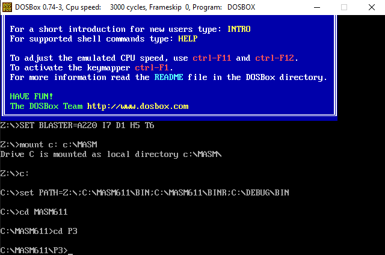

2. Abrir el ejecutable con la instruccion: main.exe

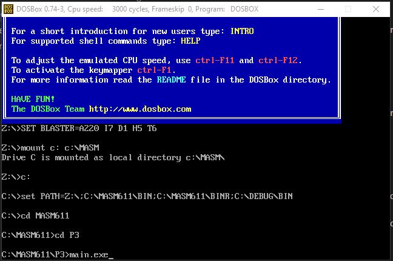

3. Se mostrará un encabezado como el siguiente y se solicitará que presione la letra Enter.

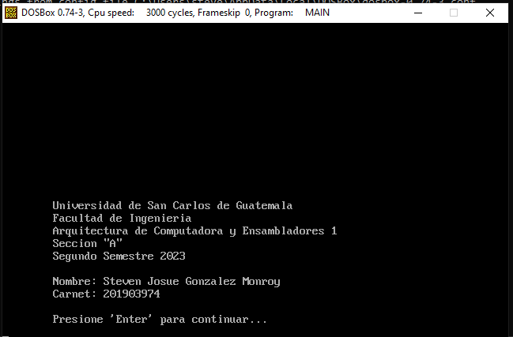

### Menu

Luego de iniciar el ejecutable y presionar la tecla enter se mostrará un menú como el siguiente:

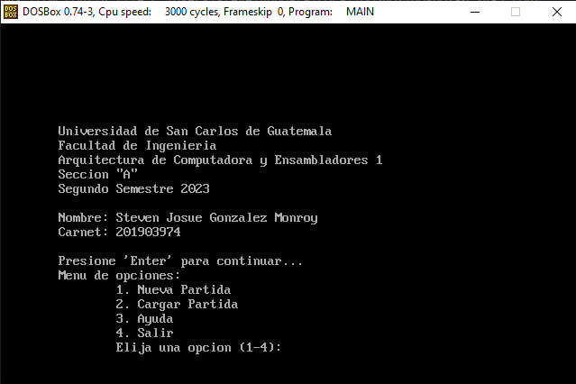

- Se debe presionar la tecla con el número de la opcion a la que desa acceder.

### Partida Jugador vs Jugador

Para poder jugar una partida Jugador vs Jugador es necesario hacer lo siguiente:

1. Presionar la tecla "1" al momento de estar en el Menu:

2. En el siguiente submenu, presionar la tecla "1" para iniciar una partida:

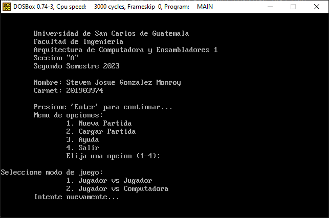

3. Introducir los nombres de los jugadores y luego presionar la tecla Enter

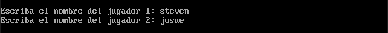

5. Presionar la tecla con el valor de la columna en donde el jugador con el turno actual desea colocar su ficha:

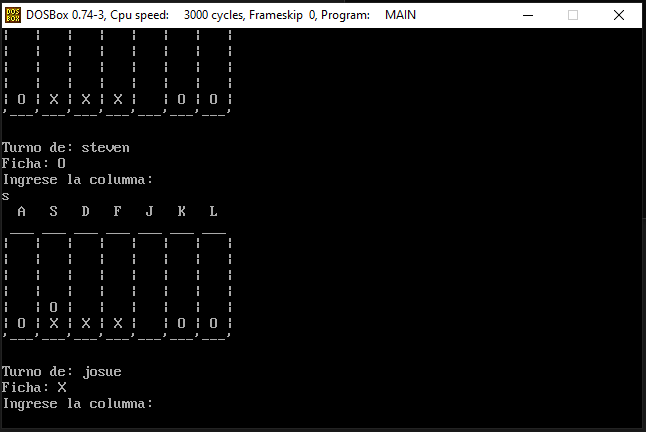

- Las teclas permitidas para seleccionar columnas son:
    - a
    - s
    - d
    - f
    - j
    - k
    - l

- Los turnos de los jugadores cambian autopmaticamente despues de que cada uno selecciona una columna para colocar su ficha.

6. Cuando un jugador coloque 4 fichas iguales de manera seguida en cualquier posición, gana la partida.

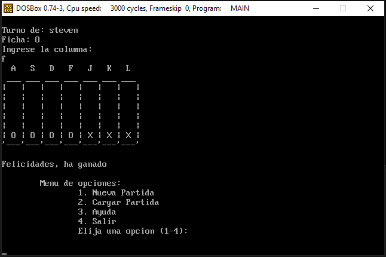

- Al terminar una partida automaticamente se muestra el menu para elegir una opción.

### Partida Jugador vs Computadora

Para poder jugar una partida Jugador vs Computadora es necesario hacer lo siguiente:

1. Presionar la tecla "1" al momento de estar en el Menu:

2. En el siguiente submenu, presionar la tecla "2" para iniciar una partida:

3. Introducir el nombres del jugador y luego presionar la tecla Enter

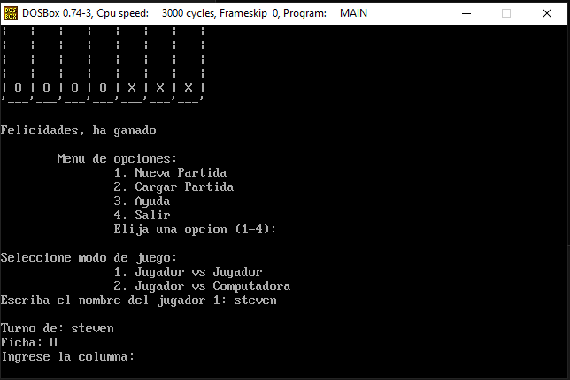

5. Presionar la tecla con el valor de la columna en donde el jugador con el turno actual desea colocar su ficha:

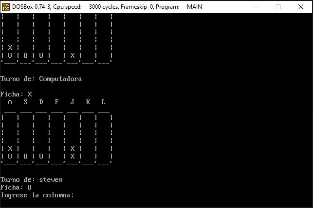

- Las teclas permitidas para seleccionar columnas son:
    - a
    - s
    - d
    - f
    - j
    - k
    - l

- Los turnos del jugador y la computadora cambian automaticamente luego de que el jugador coloca una ficha.

6. Cuando el jugador coloque 4 fichas iguales de manera seguida en cualquier posición, gana la partida.

- Al terminar una partida automaticamente se muestra el menu para elegir una opción.

### Guardar Partida

Para guardar una partida es necesario hacer lo siguiente:

1. Al estar en una partida en curso, presionar la tecla "w", y escribir el nombre con el que se quiere que se guarde el archivo de guardado:

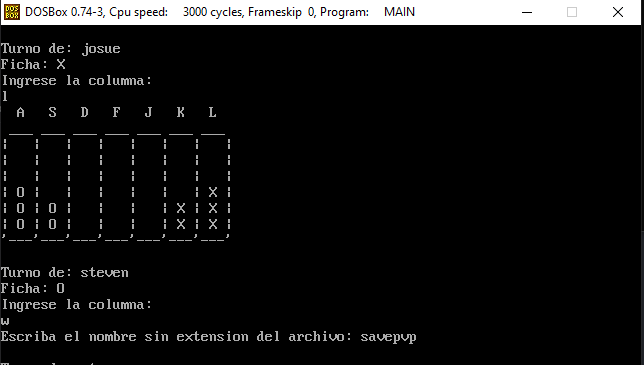

- Esto guardará los datos de la partida en un archivo con el nombre indicado para posteriormente volver a cargar la partida.

### Cargar Partida

Para cargar una partida previamente gurdada es necesario hacer lo siguiente: 

1. Al estar en el menu principal, presionar la tecla "2", luego introducir el nombre del archivo con los datos de la partida:

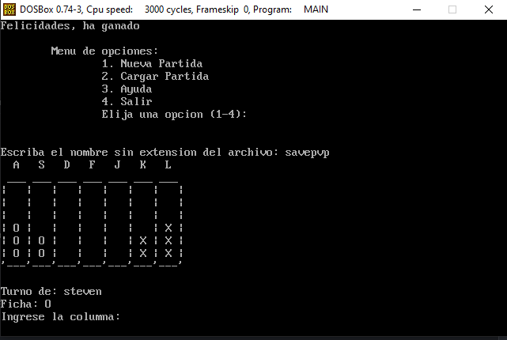

- Luego se mostrará el tablero actualizado con las fichas y podrá continuar con la partida.

### AYUDA

En caso de que el usuario no conzca las reglas del juego podra acceder a una opcion de ayuda donde se le mostrará información para porder solucionar sus dudas. Para acceder a la informacion de ayuda es necesario hacer lo siguiente:

1. En el menu principal, presionar la tecla "3":

2. Se mostrará la información de ayuda en secciones de 20 lineas:

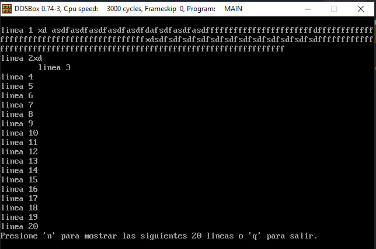

3. para mostrar las siguientes 20 lineas de información se debe presionar la tecla "n":

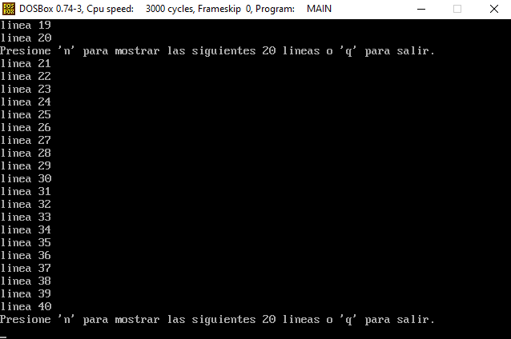

4. Para salir de la sección de ayuda se deberá presionar la tecla "q", y se regresará al menú principal nuevamente:

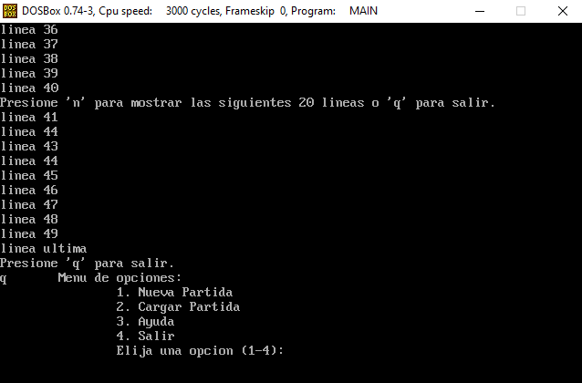

### Reporte de Partida:

Al final de cada partida, se generará un reporte en formato HTML llamado "REP.HTM" el cual contendrá información relevante de la partida:

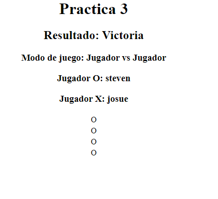